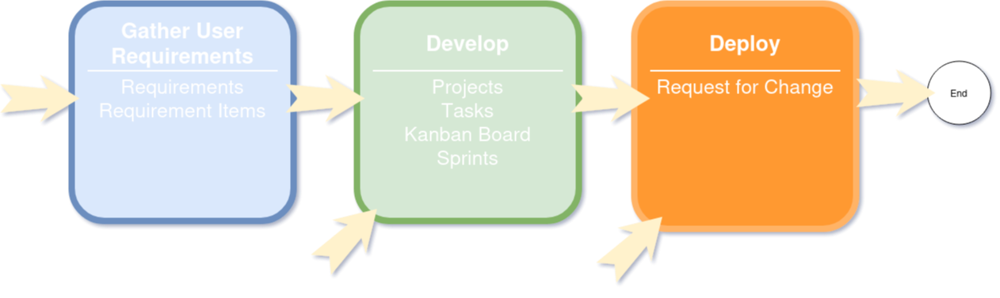

.. _nearbeach_flow:

==============
NearBeach Flow
==============

What is NearBeach Flow?
=======================

What is NearBeach Flow? We have several beliefs when it comes to project management;

* Things always go wrong
* Quoting is really hard and no one gets it correct
* User requirements/User stories are lost

We have structured NearBeach so the following modules are all separate modules;

* Requirements/Requirements Items
* Projects/Tasks
* Kanban Board
* Sprints
* Request For Change

The structure of NearBeach is setup in this manner, so you can pick and choose your flow between each of the different
modules. For example, you might not have any user requirements, and just use the task functionality in NearBeach. This
is perfectly fine for any small and quick tasks. Then there are some projects that have a lot of user requirements.
These requirements should be stored in NearBeach, where they can be broken down into smaller requirement items. Relevant
projects/tasks/kanban cards can then be connected to the original requirement items.

The following diagram best describes the entrance points for NearBeach, and the final exit point.

How Does It Work
================

User Requirements
-----------------

Requirements are a helicopter view of the project at hand. For example;

* Building a new site for Client X
* Rebranding merchandise
* Implementing a new ticketing system

For each smaller and detailed user story, you should use requirement items. For example;

* Implementation of the new API to accept payments
* Deployment of the CI/CD pipeline
* Creation of a new page for the Product X

Once you have laid out in your requirement, and requirement items, you can easily create Projects/Tasks to link back to
each requirement item. One requirement item could have multiple projects/tasks. It is not defined as a 1-to-1
relationship.

For example, the requirement item "Creation of a new page for the Product X" can have the following tasks;

* Photography and Images of new product X for page
* Design of new web page for product X
* Construct the CSS for new web page for product X
* Frontend build of the new web page for product X

As you can see, each task is required for this user story. However the tasks themselves are completely different and
usually tackled by different departments. The photographer usually does not tackle the frontend code for the web page.

Projects/Tasks
--------------

Though projects and tasks are similar in NearBeach, there is one small definition difference. Tasks are considered to be
small and quick tasks, where projects can be more complicated, and thus can be broken down into smaller tasks.

For example we have the following project "Setup new EC2 Instance for webserver", which will contain the following
tasks;

* Setup EC2 server on AWS
* Install required LAMP stack + Required Software
* Setup Firewall on EC2

So that small project has a bunch of smaller tasks.

**Question:** What if I am the only one who does this project?

**Answer:** How you utilise NearBeach is up to you. You can easily not create any of the extra tasks, and just keep it as a
a single project. That will work perfectly fine, however we recommend splitting up projects if they start getting large,
or there are multiple people involved. That way you can assign responsibilities at the task levels.

Kanban Boards
-------------

For users who like to see things visually we have implement a Kanban board. The kanban board is customisable, where
users can defined each column and level. Users will also be able to create cards, or link in existing tasks/projects.

Request For Change
------------------

The Request For Change module in NearBeach is designed to;

* Describe the change you want to implement
* Describe the risk of the change
* Describe the implementation and back-out plan of the change
* Describe the test plan of the change
* Detail to the end user, when the change is happening and the process around that change

The request for change also has "Change Tasks", which are a single task done at a certain point in the change process.
These change tasks can be assigned to a user, with a QA to sign off. The RFC functionality in NearBeach can be used to
track these changes as it is applied.