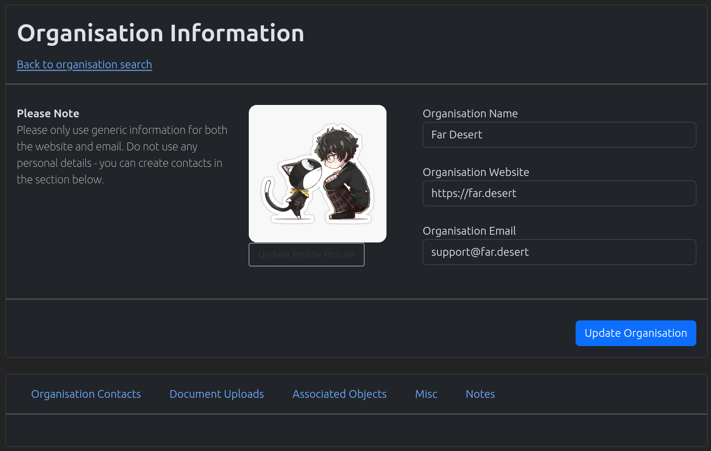
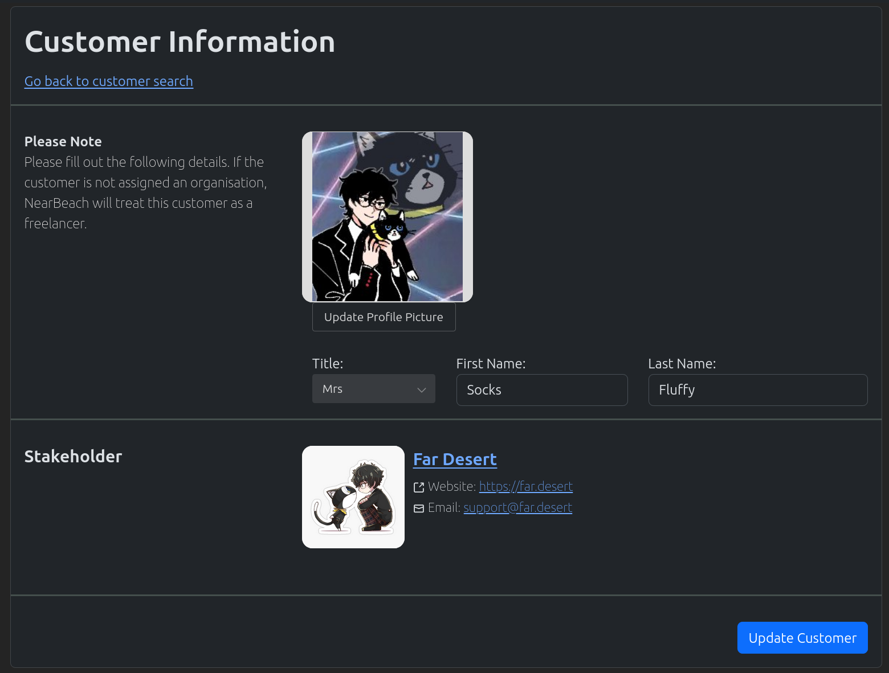
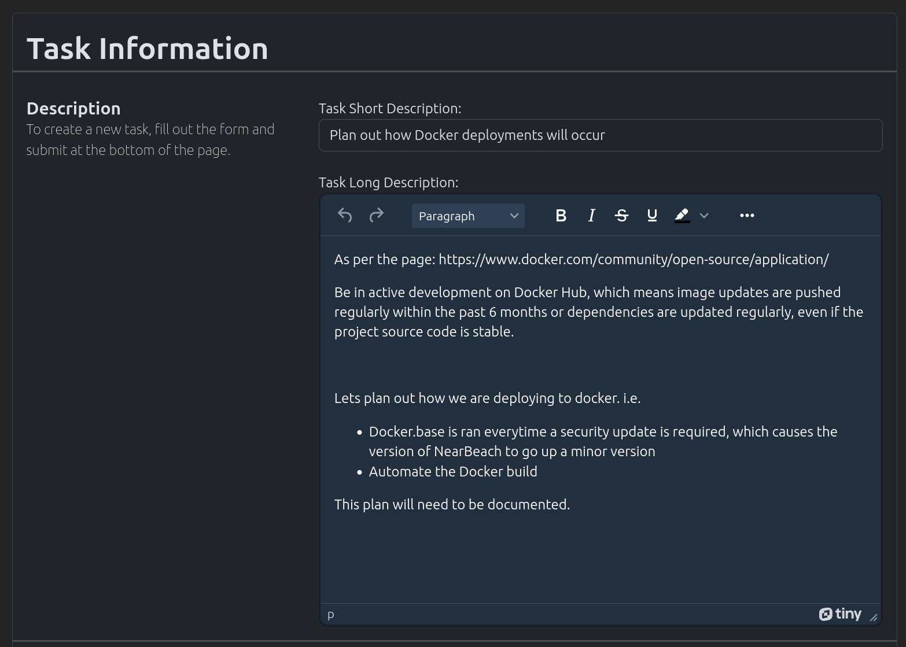

.. _basic_usage_index:

===========
Basic Usage
===========

NearBeach is constructed to have the following objects

-------------
Organisations
-------------

Organisations are used to store basic contact details. Items that can be looked up at the organisation level are;

- Customers connected to the organisation
- Documents uploaded to the organisation
- Any currently opened object like projects/tasks
- Notes about the organisations

---------
Customers
---------

Customers are used to store basic contact details.

------------
Requirements
------------

.. image:: requirement-screenshot.png
    :width: 600
    :alt: Screenshot of the Requirement

Requirement are used to gather customer's requirements. These requirements should be kept at a high/helicopter level
and any extra details should be placed within the requirement items (sub objects of requirements). The requirements
are meant to organise any requirement items into one place.

Current features for the requirements are;

- Assigning Users and Groups to the requirement
- Creating Requirement Items for the requirements. Requirement items will supply the finer detail for the customer
  requirements
- Linking the requirement into other objects like projects and tasks
- Uploading Documentation
- Assigning to specific customers from an organisation
- Creating and managing sprints for this particular requirement
- Tracking the progress of those sprints
- Assigning tags to the requirement
- Creating a public link for the requirement so users can track it's progress
- Assigning notes to the requirement

------------
Kanban Board
------------

.. image:: kanban-board-screenshot.png
    :width: 600
    :alt: Screenshot of the Kanban Board functionality

Users will be able to create their own kanban board. The functionality includes;

- Creating cards
- Customising the columns and the levels of the board
- Adding in external objects like projects/tasks
- Cards have the ability to have notes applied to them
- Cards have the ability to have documents uploaded against them
- Levels have the ability to be minimised
- Public links can be create for the kanban board and cards

--------------
Projects/Tasks
--------------

Projects are considered higher in the object chain than tasks. A project should have tasks under it. However a single
task might not be large enough for a project. It is up to the user for the definitions between projects/tasks.

Projects and Tasks have the following functionality;

- Users and Groups can be assigned
- Uploading Documentation
- Assigning to specific customers from an organisation
- Assigning tags to the project/tasks
- Creating a public link for the project/task so users can track it's progress
- Assigning notes to the project/task
- PROJECT ONLY: Creating and managing sprints for this particular project
- PROJECT ONLY: Tracking the progress of those sprints

------------------
Request For Change
------------------

Request for changes are used to notify all stakeholders of a deployment and it's process. These are usually
managed by the "Change Advisory Board" and should detail out which responsibilities fall on which users, and what
time those responsibilities are implemented.

Information stored in a request for change (RFC) are;

- RFC Title
- RFC Description
- RFC Change Type
- Version Number
- Implementation Start, End, and Release Date
- RFC Lead
- Risk of RFC and Association of those risks
- Implementation Plan
- Backout process
- Test Plan
- Change tasks which can be assigned to users