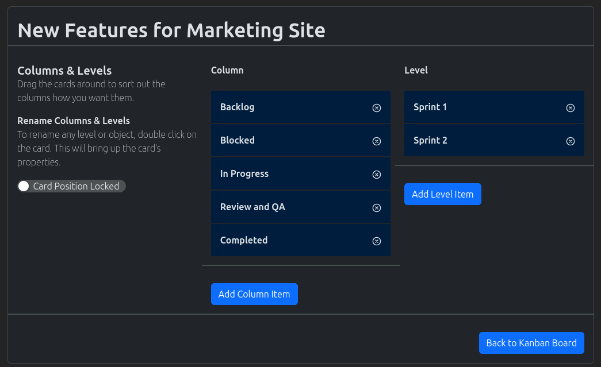

.. _kanban_board_crud:

============
Kanban Board
============

.. image:: kanban-board-screenshot.png
    :width: 600
    :alt: Screenshot of the Kanban Board functionality

Users will be able to create their own kanban board.

-------------------
Create Kanban Board
-------------------

#. In the navigation menu at the top of the page. Click the option "New Object"

#. In the dropdown, click on the option "New Kanban Board"

#. The "New Kanban Board" page will load.

#. Create a unique name for the kanban board. If the board already exists, it will notify you in red text.

#. In the level section, the cards can be moved around to represent their order on the board. Double clicking on the cards will allow the user to edit the description of the level.

#. In the column section, the cards can be moved around to represent their order on the board. Double clicking on the card will allow the user to edit the description and the column's property. The column's properties can be broken down into;

    * Backlog - marks the card as being in backlog.

    * Normal - marks the card as being normal

    * Blocked - marks the card as being blocked. A dialog will appear when a card is moved into this location

    * Completed - marks the card as being completed.

#. Pick the appropriate groups from the selection box.

#. Click on the "Add kanban" button for the kanban board to be created.

-------------------
Search Kanban Board
-------------------

#. In the navigation menu at the top of the page. Click on the option "Find Objects"

#. In the dropdown, click on the option "List all Objects"

#. The "Search" page will load. Use the search field to search for your required kanban board.

.. note:: Spaces are considered wildcards in this search.

----------------------------
Update Kanban Board Settings
----------------------------

#. On the kanban board information page, click on the drop down "Kanban Menu"

#. In the dropdown menu, choose the option "Edit Kanban"

#. The "Edit Kanban" page will now load

#. Make the appropriate changes on this page, once done hit the "Back to Kanban Board"

.. note:: All changes are saved automatically

.. note:: Double clicking on either the column/level cards will open the edit modal for them.

-----------------
Create a New Card
-----------------

^^^^^^^^^^
Using Menu
^^^^^^^^^^

#. On the kanban board information page, click on the drop down "Kanban Menu"

#. In the dropdown menu, choose the option "Add New Card"

#. The "New Card Modal" will appear, fill it out appropriately

^^^^^^^^^^^
Using Board
^^^^^^^^^^^

#. On the kanban board information page, move your mouse across the board

#. In the appropriate cell, click on the button "New Card"

#. The "New Card Modal" will appear, fill it out appropriately

-----------------------------------
Link in existing Projects and Tasks
-----------------------------------

^^^^^^^^^^
Using Menu
^^^^^^^^^^

#. On the kanban board information page, click on the drop down "Kanban Menu"

#. In the dropdown menu, choose the option "Add New Link to Object"

#. The "New Kanban Link Wizard" modal will appear

#. Use the search options to find the appropriate object, select and then add to the board

^^^^^^^^^^^
Using Board
^^^^^^^^^^^

#. On the kanban board information page, move your mouse across the board

#. In the appropriate cell, click on the button "Link Object"

#. The "New Kanban Link Wizard" modal will appear

#. Use the search options to find the appropriate object, select and then add to the board

-------------
Editing Cards
-------------

Users will be able to edit a card by either double clicking on the card, or clicking on the (i) information icon.

.. note:: Any linked objects will not open the card modal. Instead they will go directly to that object.

---------------
Card Edit Modal
---------------

The card edit modal is broken up into the following sections;

* Details
* Description
* Note
* Users
* Downloads
* Misc

^^^^^^^^^^^^
Card Details
^^^^^^^^^^^^

This tab stores the following information for the card;

* Card title - the title of the card as displayed on the board
* Card priorty - the priority of the card as displayed on the board
* Card location - the location of the card on the board

^^^^^^^^^^^
Description
^^^^^^^^^^^

This tab stores the description of the card. Users will be able to use the description field to bring more detail into
the card.

^^^^
Note
^^^^

This tab stores all the notes made against the card. It even stores the "Blocked" notes, when a card has been moved into
the blocked column. Users will be able to edit their prior notes.

^^^^^
Users
^^^^^

This tab stores which users have been assigned to this card

^^^^^^^^^
Downloads
^^^^^^^^^

This tab stores the documents uploaded against this card. Each card can hold separate documents.

^^^^
Misc
^^^^

This tab stores the assigned tags and the public links.

To add an assign tag, please click the "Add Tag to Kanban Card" and follow the wizard. To remove a tag, click on the
"delete" icon against the tag.

To create a public link please click the "Create public link". This link can be shared with the public and they will
have basic access to the kanban card. To delete the public link please click on the "delete" icon.
