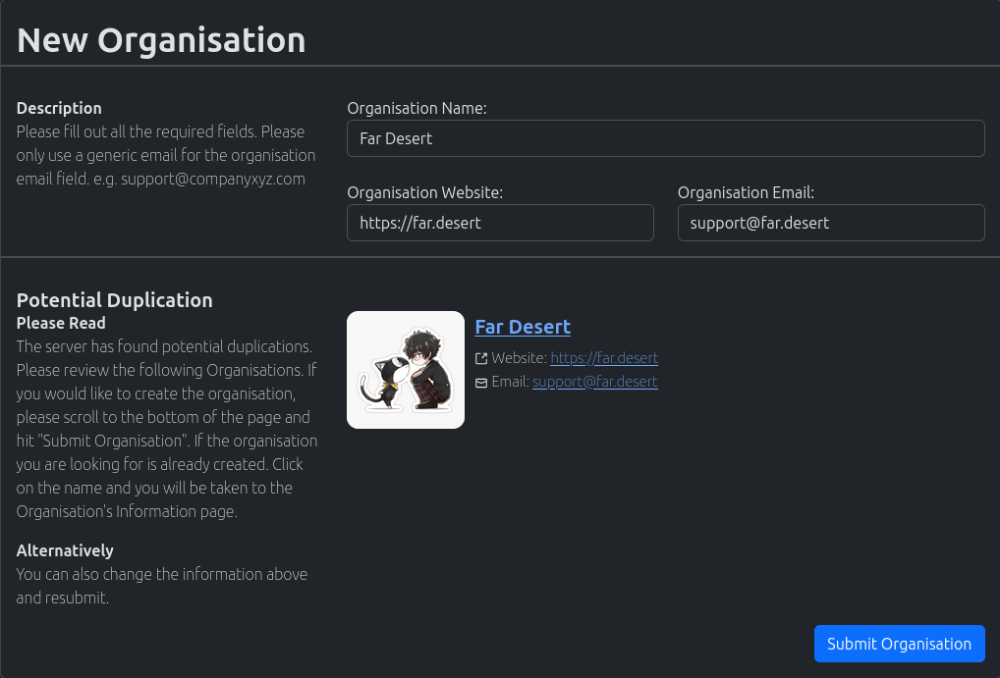
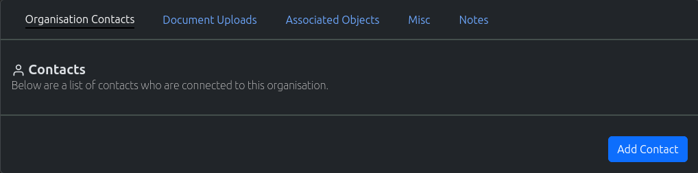

.. _organisation_crud:

============
Organisation
============

.. image:: organisation-screenshot.png
    :width: 600
    :alt: Screenshot of Organisation inside NearBeach

Organisations are used to store basic contact details.

----------------------
Create An Organisation
----------------------

#. In the navigation menu at the top of the page. Click on the option "New Object"

#. In the dropdown, click on the option "New Organisation"

#. The "New Organisation" page will load. Fill out the organisation form appropriately

#. Once completed, click on the "Add Organisation" button

.. note:: If the system detects a duplicated organisation. It will return back to this page to get confirmation. If this
    organisation is a duplicate, just leave the page. If it is not a duplicate please click the "Submit Organisation" button

----------------------
Search An Organisation
----------------------

#. In the navigation menu at the top of the page. Click on the option "Find Objects"

#. In the dropdown, click on the option "List Organisation"

#. The "List Organisations" page will load. Use the search field to search for your required organisation.

.. note:: Spaces are considered wildcards in this search.

----------------------
Update An Organisation
----------------------

#. Use the method above to find the appropriate Organisation you wish to edit.

#. Edit the Organisation, and once completed click on the "Update Organisation" button

.. note:: To update/change profile pictures. Click on the "Update Profile" button.
    Profile pictures are updated automatically when saved.

-------------
Misc Features
-------------

* Connection with Organisation Customers
* Ability to upload documents against an organisation
* Ability to find current open associated objects, i.e. currently opened projects and tasks
* Ability to assign tags to an organisation
* Ability to write notes against an organisation
