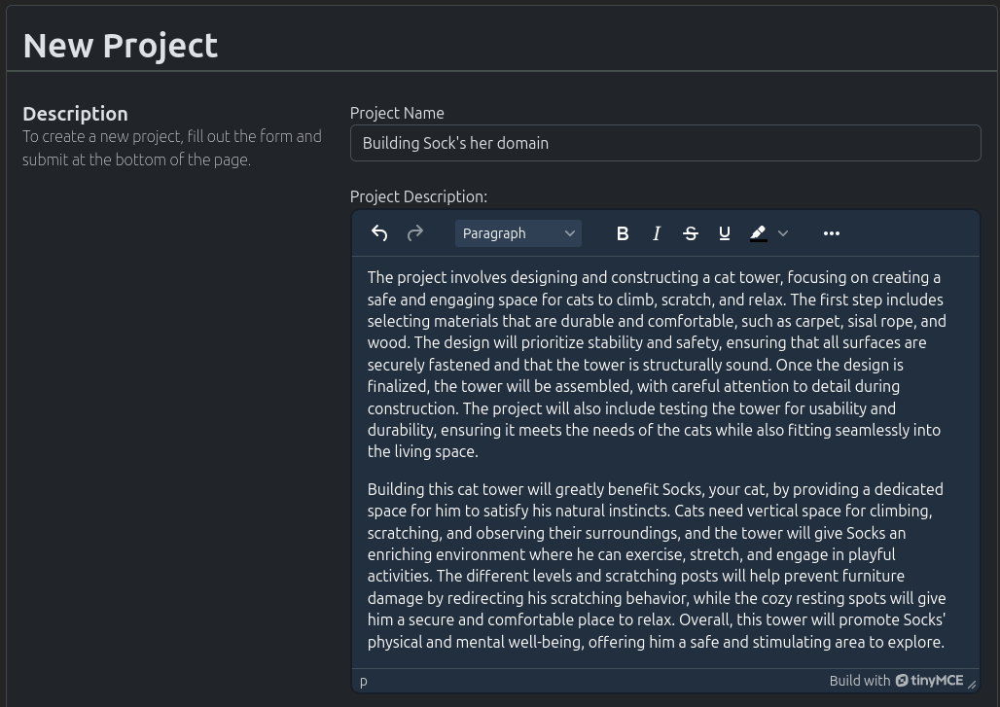
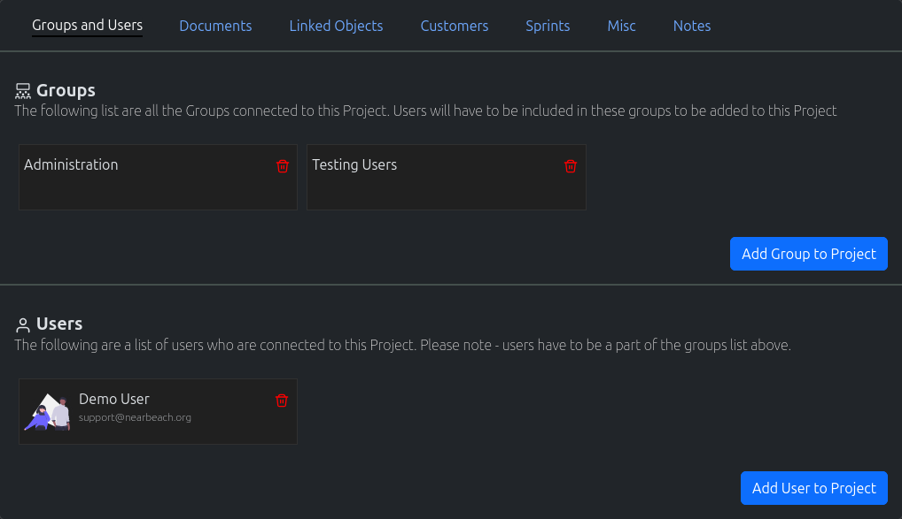

.. _project_crud:

========
Projects
========

--------------
Create Project
--------------

#. In the navigation menu at the top of the page. Click on the option "New Object"

#. In the dropdown, click on the option "New Project"

#. The "New Project" page will load. Fill out the form appropriately and click on the "Create New Project"

--------------
Search Project
--------------

#. In the navigation menu at the top of the page. Click on the option "Find Objects"

#. In the dropdown, click on the option "List all Objects"

#. The "Search" page will load. Use the search field to search for your required project.

.. note:: Spaces are considered wildcards in this search.

--------------
Update Project
--------------

#. Use the method above to find the appropriate Project you wish to edit.

#. Edit the Project, and once completed click on the "Update Project" button

--------------------------
Misc Project Functionality
--------------------------

The following are misc/common functionality;

* **Add Group To Project -** :ref:`More Information <Add Group To Object>`
* **Assign Customer To Project -** :ref:`More Information <Assign Customer To Object>`
* **Adding Links to Other Objects -** :ref:`More Information <Adding Links to other Objects>`
* **Documentation -** :ref:`More Information <Documentation>`
* **Adding Customers To Projects -** :ref:`More Information <Adding Customers To Objects>`
* **Creating New Sprints -** :ref:`More Information <Creating New Sprints>`
* **Assigning Tags To Projects -** :ref:`More Information <Assigning Tags to Objects>`
* **Creating Public Links for Projects -** :ref:`More Information <Creating Public Links for Objects>`
* **Writing Notes for A Project -** :ref:`More Information <Writing Notes for An Object>`
