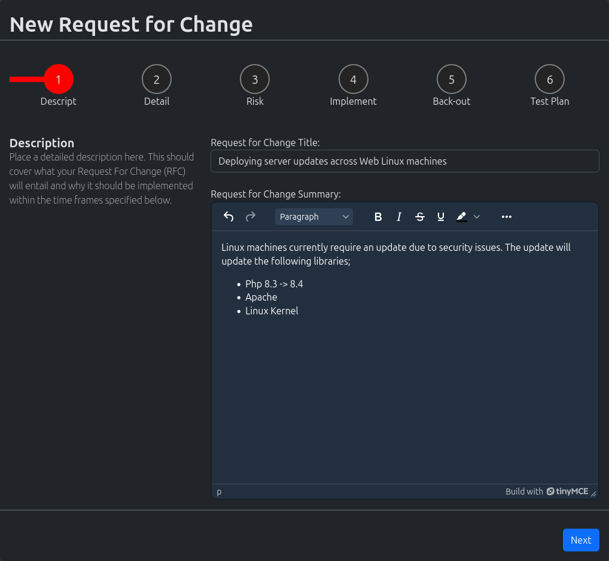
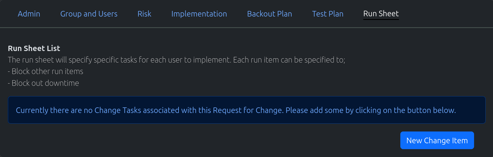
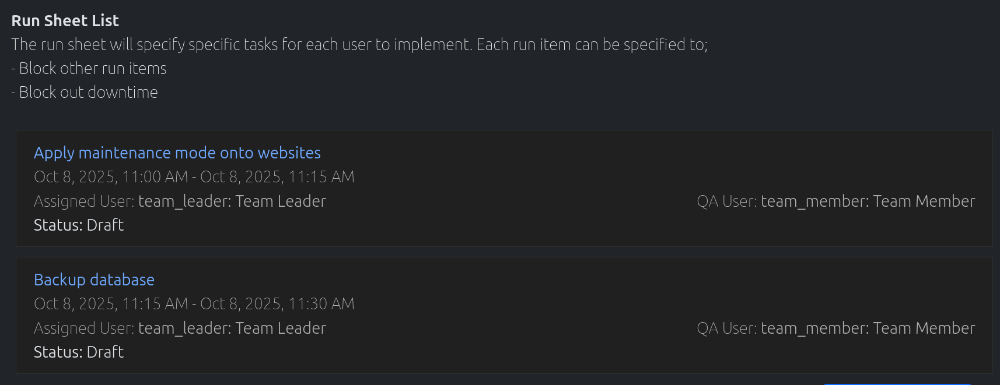

.. _request_for_change:

Request For Change
##################

Request for changes are used to notify all stakeholders of a deployment and it's processes. These are usually
managed by the "Change Advisory Board" and should detail out which responsibilities falls on which users. Exactly
what time a task will be implemented and how long it will take.

Create New Request For Change
=============================

#. In the navigation menu at the top of the page. Click on the option "New Object"

#. In the dropdown, click on the option "New Request for Change"

#. The "New Request for Change" wizard will load. The steps are broken down into;

    #. **Description** - A basic description/summary of the RFC and what it entails

    #. **Detail** - Detailing the priorty of the RFC along with those responsible

    #. **Risk** - Outlining the risk of the RFC, and the implications if RFC is not implemented

    #. **Implementation** - Outline of the process around implementing

    #. **Back out** - Outline of the back out plan if something goes wrong

    #. **Test plan** - Outline the test plan to make sure all services are functioning

#. Fill out all the fields with appropriate information and submit. You will be redirected to the newly created RFC draft.

#. You will now be able to create the run sheet, by adding in "Change Tasks". Once completed, submit the RFC for approval

Search for Request For Change
=============================

#. In the navigation menu at the top of the page. Click on the option "Find Objects"

#. In the dropdown, click on the option "List all Objects"

#. The "Search" page will load. Use the search field to search for your required request for change.

.. note:: Spaces are considered wildcards in this search.

Update Request For Change
=========================

#. Use the method above to find the appropriate Request for Change you wish to edit.

#. Edit the Request for change, and once completed click on the "Update Request for Change" button

Create Change Tasks
===================

**Assumption:** You are currently on a draft of a Request for Change

#. Under the "Run Sheet" section, click on the "New Change Item"

#. The "Change Task" wizard will appear

    .. image:: change-task-wizard-screenshot.png
        :width: 600
        :alt: Screenshot of the Change task wizard

#. Fill out the form appropriately. Please note the datetime should reflect the start and end date of this particular task.

#. Click either of the "Add" buttons to add the change task. The newly created change task will appear in the list.

Update Change Tasks
===================

#. Find the Change Task you would like to edit, and click on it

#. Change Task information page will load

#. Edit the fields appropriately and hit the "Save" button to update the change task

#. The following information for the change task is located at the bottom of the page

    #. **Change Task Links** - Defines which changes tasks will be blocking this particular change task

    #. **Description** - Further explaination of the change task (optional)

    #. **Misc** - Defines if there is downtime, or defines who the stakeholders are for this task

#. To navigate back to the Request for Change, click on the "Go Back" link at the top of the page

Starting Request For Change
===========================

**Assumption:** You are currently on a draft of a Request for Change

#. To start a RFC, click on the "Submit RFC for Approval".

#. The RFC is sent to all Team Leaders within the assigned groups.

#. At least one team leader from each group has to approve with no rejections

#. If there are no team leaders for the groups, an auto approval process will occur
