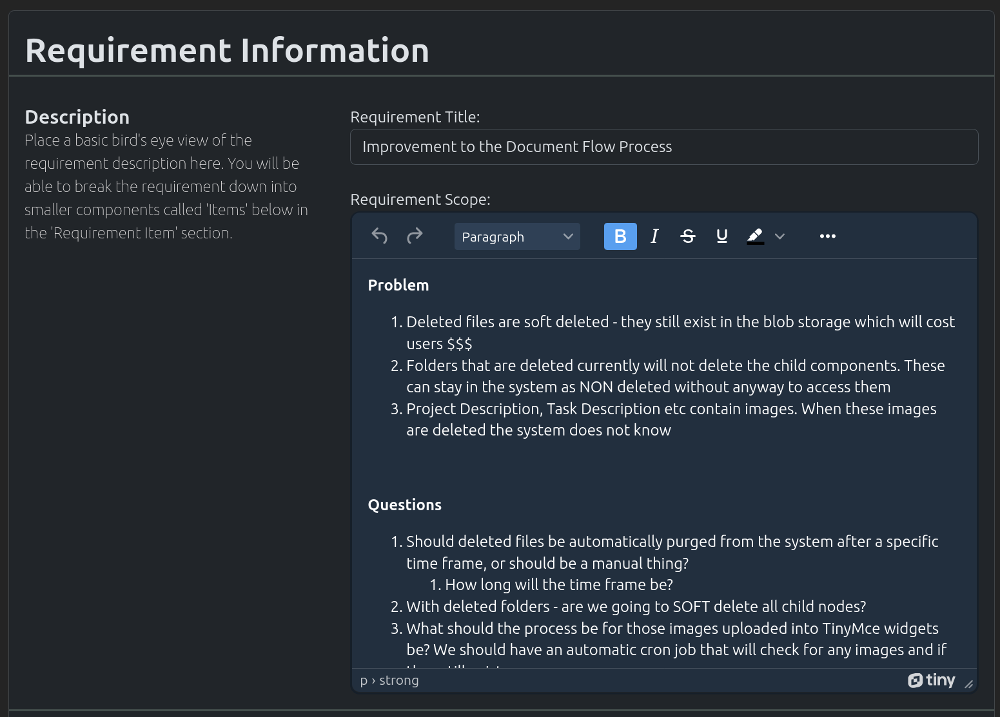
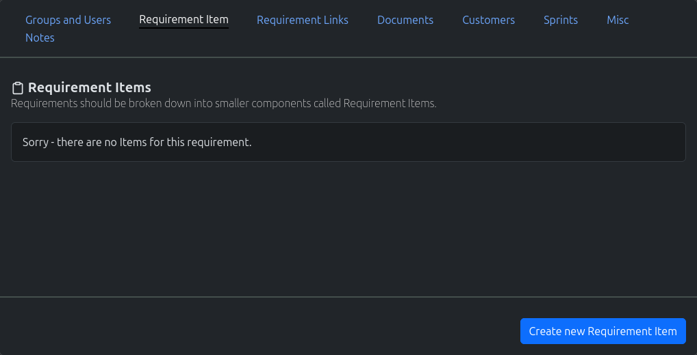

.. _requirement_crud:

===========
Requirement
===========

Requirement are used to gather customer's requirements. These requirements should be kept at a high/helicopter level
and any extra details should be placed within the requirement items (sub objects of requirements).

------------------
Create Requirement
------------------

#. In the navigation menu at the top of the page. Click on the option "New Object"

#. In the dropdown, click on the option "New Requirement"

#. The "New Requirement" page will load. Fill out the form appropriately and click on the "Create New Requirement"

------------------
Search Requirement
------------------

#. In the navigation menu at the top of the page. Click on the option "Find Objects"

#. In the dropdown, click on the option "List all Objects"

#. The "Search" page will load. Use the search field to search for your required requirement.

.. note:: Spaces are considered wildcards in this search.

------------------
Update Requirement
------------------

#. Use the method above to find the appropriate Requirement you wish to edit.

#. Edit the Requirement, and once completed click on the "Update Requirement" button

------------------------------
Misc Requirement Functionality
------------------------------

.. image:: requirement_misc_functionality.png
    :width: 600
    :alt: Screenshot of the requirement misc functionality

The following are misc/common functionality;

* **Add Group To Requirement -** :ref:`More Information <Add Group To Object>`
* **Assign Customer To Requirement -** :ref:`More Information <Assign Customer To Object>`
* **Adding Links to Other Requirement -** :ref:`More Information <Adding Links to other Objects>`
* **Documentation -** :ref:`More Information <Documentation>`
* **Adding Customers To Requirement -** :ref:`More Information <Adding Customers To Objects>`
* **Creating New Sprints -** :ref:`More Information <Creating New Sprints>`
* **Assigning Tags To Requirement -** :ref:`More Information <Assigning Tags to Objects>`
* **Creating Public Links for Requirement -** :ref:`More Information <Creating Public Links for Objects>`
* **Writing Notes for An Requirement -** :ref:`More Information <Writing Notes for An Object>`

--------------------------
What is a Requirement Item
--------------------------

Requirements should be split up into smaller sections (or items). Requirement items are those sections. Requirements are
higher helicopter looks, where as the Requirement Items are more detailed and closer to the ground level.

For example: The below section has a requirement, which then has three requirement items.

* **Requirement:** Build a website
* **Requirement Item:** Website to contain landing page, contact us page, and blogs page
* **Requirement Item:** Website widget to inform customer of current operational status
* **Requirement Item:** Website design should match the new branding

-----------------------
Create Requirement Item
-----------------------

#. Under the "Requirement Item" tab, click on the button "Create a new Requirement Item"

#. The "New Requirement Item Wizard" will appear. Fill it out appropriately and hit "Save Requirement Item"

The new requirement item will now appear in the list. If you want to view, please click on the appropriate item in the
list.
