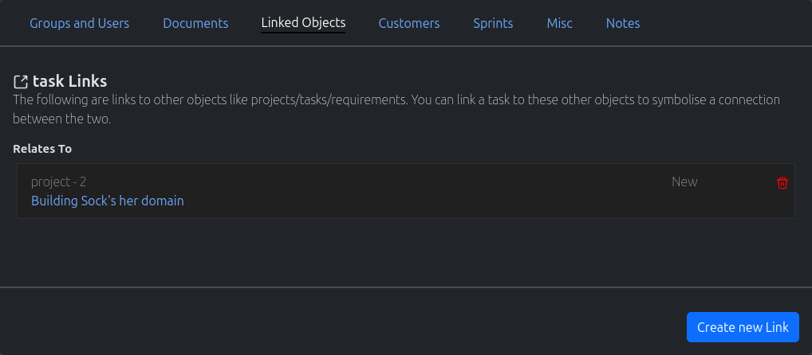

.. _task_crud:

====
Task
====

.. image:: task-screenshot.png
    :width: 600
    :alt: Screenshot of the task page

-----------
Create Task
-----------

#. In the navigation menu at the top of the page. Click on the option "New Object"

#. In the dropdown, click on the option "New Task"

#. The "New Task" page will load. Fill out the form appropriately and click on the "Create New Task"

-----------
Search Task
-----------

#. In the navigation menu at the top of the page. Click on the option "Find Objects"

#. In the dropdown, click on the option "List all Objects"

#. The "Search" page will load. Use the search field to search for your required task.

.. note:: Spaces are considered wildcards in this search.

-----------
Update Task
-----------

#. Use the method above to find the appropriate Task you wish to edit.

#. Edit the Task, and once completed click on the "Update Task" button

-----------------------
Misc Task Functionality
-----------------------

The following are misc/common functionality;

* **Add Group To Task -** :ref:`More Information <Add Group To Object>`
* **Assign Customer To Task -** :ref:`More Information <Assign Customer To Object>`
* **Adding Links to Other Objects -** :ref:`More Information <Adding Links to other Objects>`
* **Documentation -** :ref:`More Information <Documentation>`
* **Adding Customers To Tasks -** :ref:`More Information <Adding Customers To Objects>`
* **Creating New Sprints -** :ref:`More Information <Creating New Sprints>`
* **Assigning Tags To Tasks -** :ref:`More Information <Assigning Tags to Objects>`
* **Creating Public Links for Tasks -** :ref:`More Information <Creating Public Links for Objects>`
* **Writing Notes for A Task -** :ref:`More Information <Writing Notes for An Object>`
